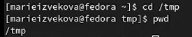
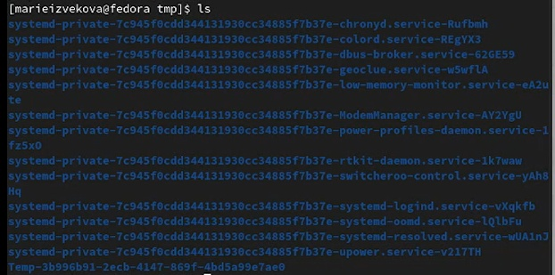

---
## Front matter
title: "Лабораторная работа №4"
subtitle: "Основы интерфейса взаимодействия пользователя с системой Unix на уровне командной строки"
author: "Извекова Мария Петровна, группа НКАбд-01-22"

## Generic otions
lang: ru-RU
lang: eng-ENG

## Bibliography
bibliography: bib/cite.bib
csl: pandoc/csl/gost-r-7-0-5-2008-numeric.csl

## Pdf output format
toc: true # Table of contents
toc-depth: 2
lof: true # List of figures
lot: true # List of tables
fontsize: 12pt
linestretch: 1.5
papersize: a4
documentclass: scrreprt
## I18n polyglossia
polyglossia-lang:
  name: russian
  options:
	- spelling=modern
	- babelshorthands=true
polyglossia-otherlangs:
  name: english
## I18n babel
babel-lang: russian
babel-otherlangs: english
## Fonts
mainfont: PT Serif
romanfont: PT Serif
sansfont: PT Sans
monofont: PT Mono
mainfontoptions: Ligatures=TeX
romanfontoptions: Ligatures=TeX
sansfontoptions: Ligatures=TeX,Scale=MatchLowercase
monofontoptions: Scale=MatchLowercase,Scale=0.9
## Biblatex
biblatex: true
biblio-style: "gost-numeric"
biblatexoptions:
  - parentracker=true
  - backend=biber
  - hyperref=auto
  - language=auto
  - autolang=other*
  - citestyle=gost-numeric
## Pandoc-crossref LaTeX customization
figureTitle: "Рис."
tableTitle: "Таблица"
listingTitle: "Листинг"
lofTitle: "Список иллюстраций"
lotTitle: "Список таблиц"
lolTitle: "Листинги"
## Misc options
indent: true
header-includes:
  - \usepackage{indentfirst}
  - \usepackage{float} # keep figures where there are in the text
  - \floatplacement{figure}{H} # keep figures where there are in the text
---

# Цель работы

Приобретение практических навыков взаимодействия пользователя с системой по-
средством командной строки.

# Теоретическое введение

**Команда man.** Команда man используется для просмотра (оперативная помощь) в диа-
логовом режиме руководства (manual) по основным командам операционной системы
типа Linux.

**Команда cd.** Команда cd используется для перемещения по файловой системе опера-
ционной системы типа Linux.

**Команда pwd.** Для определения абсолютного пути к текущему каталогу используется
команда pwd (print working directory).

**Команда ls.** Команда ls используется для просмотра содержимого каталога.

**Команда mkdir.** Команда mkdir используется для создания каталогов.

**Команда rm.** Команда rm используется для удаления файлов и/или каталогов.

**Команда history.** Для вывода на экран списка ранее выполненных команд исполь-
зуется команда history. Выводимые на экран команды в списке нумеруются. К любой
команде из выведенного на экран списка можно обратиться по её номеру в списке,
воспользовавшись конструкцией !<номер_команды>.

# Выполнение лабораторной работы

1. Определяем полное имя моего домашнего каталога использую команду pwd. Далее работаем относительно этого каталога (рис. @fig:001)

{#fig:001 width=70%}

2. Переходим в каталог /tmp с помощью команды cd. (рис. @fig:002)

{#fig:002 width=70%}

3. с помощью команды ls мы выводим список файлов и каталогов в этой файловой системе (рис. @fig:003)

{#fig:003 width=70%}

дополнительная команда -l  выведет на тип каждого файла (рис. @fig:004)

{#fig:004 width=70%}

4. Определяем с помощью команды ls в каталоге /var/spool наличие подкаталога cron.
(рис. @fig:005 - @fig:006)

{#fig:005 width=70%}

{#fig:006 width=70%}

5. возвращаемся в домашний каталог и выводим его содержимое на экран (рис. @fig:007)

{#fig:007 width=70%}

с помощью команды  ls -l выводим владельца каталога и подкаталогов (рис. @fig:008)

{#fig:008 width=70%}

6. с помощью команды mkdir создаем каталог newdir и подкаталог morefun (рис. @fig:009 - @fig:010)

{#fig:009 width=70%}

{#fig:010 width=70%}

7. В домашнем каталоге одной командой создаем три новых каталога: letters, memos, misk (рис. @fig:011)

{#fig:011 width=70%}

с помощью команды rm удаляем эти каталоги (рис. @fig:012)

{#fig:012 width=70%}

8. Этой же командой удаляем каталог newdir. И потом проверяем, остался лит этот каталог.  (рис. @fig:013)

{#fig:013 width=70%}

9. С помощью команды man мы выяснем, что опцию команды ls для просмотра содержимого не только указанного каталога, но и подкаталогов, входящих в него, выполняет команды -R (рис. @fig:014 - @fig:015)

{#fig:013 width=70%}

{#fig:015 width=70%}

10. С помощью команды man мы выяснем, что опцию команды ls, повзоляющий отсортировать по времени последнего изменение выводимый список содержимого каталога, выполняет команды -c (рис.  @fig:016)

{#fig:016 width=70%}

11. С помощью команды man выводим описания следующих команд: cd, pwd, mkdir,
rmdir, rm (рис.  @fig:017 - @fig:022)

{#fig:017 width=70%}

{#fig:018 width=70%}

{#fig:019 width=70%}

{#fig:020 width=70%}

{#fig:021 width=70%}

{#fig:022 width=70%}

12. Используя информацию, полученную при помощи команды history, выполните мо-
дификацию и исполнение нескольких команд из буфера команд.

{#fig:023 width=70%}

{#fig:024 width=70%}

{#fig:025 width=70%}

{#fig:026 width=70%}

# Выводы

Я приобрела практические навыки взаимодействия пользователя с системой посредством командной строки.

# Контрольный вопросы

1. Что такое строка? Командная строка (консоль или Терминал) – это специальная программа, которая позволяет управлять компьютером путем ввода текстовых команд с клавиатуры.
2. С помощью команды pwd можно определить путь текущего каталога.
3. С помощью команды ls и опции -l можно определить тип файлов и их имена в текущем каталоге
4. С помощью команды rmdir можно удалить пустой каталог или файл, а с помощью команды rm можно удалить файл и каталог. Поэтому эти команды немного отличаются.
5. С помощью команды ls с опцией -a можно вывести скрытые файлы. 

{#fig:027 width=70%}

6. С помощью команды history можно посмотреть информацию о последних выполненных командах.
7. История нам нужна для просмотра номера команды, которую мы хотим модицифировать 

{#fig:028 width=70%}

8. {#fig:029 width=70%}

9. Экранирование - это способ заключения в кавычки одиночного символа. 
Одиночные кавычки (' ') схожи по своему действию с двойными кавычками, только не допускают обращение к переменным, поскольку специальный символ "$" внутри одинарных кавычек воспринимается как обычный символ. Внутри одиночных кавычек, любой специальный символ, за исключением ', интерпретируется как простой символ. Одиночные кавычки ("строгие, или полные кавычки") следует рассматривать как более строгий вариант чем двойные кавычки ("нестрогие, или неполные кавычки").
10. Охарактеризуйте вывод информации на экран после выполнения команды ls с опцией
l. Он выводит тип данных в дополнении к имени каждого файла,  права доступа к файлу, количество ссылок на файл, имя владельца, имя группы, размер файла в байтах и временной штамп (время последней модификации файла, если не задано другое). Для файлов с временем больше чем 6 месяцев назад или больше, чем 1 час в будущее, временной штамп содержит год вместо времени дня.
11. Относительный путь — это путь к файлу относительно текущего каталога. То есть с помощью команды pwd показываются все каталоги, через которые нужно пройти, чтобы попасть в данный каталог.
12. Команда man предоставляет информацию о любой команде и ее опциях
13. Клавиша TAB служит для автоматического дополнения
вводимых команд.
# Список литературы{.unnumbered}

::: 
:::
