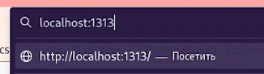

---
## Front matter
title: "Операционные системы"
subtitle: "Первый этап проекта"
author: "Извекова Мария НКАбд-01-22"

## Generic otions
lang: ru-RU
toc-title: "Содержание"

## Bibliography
bibliography: bib/cite.bib
csl: pandoc/csl/gost-r-7-0-5-2008-numeric.csl

## Pdf output format
toc: true # Table of contents
toc-depth: 2
lof: true # List of figures
lot: true # List of tables
fontsize: 12pt
linestretch: 1.5
papersize: a4
documentclass: scrreprt
## I18n polyglossia
polyglossia-lang:
  name: russian
  options:
	- spelling=modern
	- babelshorthands=true
polyglossia-otherlangs:
  name: english
## I18n babel
babel-lang: russian
babel-otherlangs: english
## Fonts
mainfont: PT Serif
romanfont: PT Serif
sansfont: PT Sans
monofont: PT Mono
mainfontoptions: Ligatures=TeX
romanfontoptions: Ligatures=TeX
sansfontoptions: Ligatures=TeX,Scale=MatchLowercase
monofontoptions: Scale=MatchLowercase,Scale=0.9
## Biblatex
biblatex: true
biblio-style: "gost-numeric"
biblatexoptions:
  - parentracker=true
  - backend=biber
  - hyperref=auto
  - language=auto
  - autolang=other*
  - citestyle=gost-numeric
## Pandoc-crossref LaTeX customization
figureTitle: "Рис."
tableTitle: "Таблица"
listingTitle: "Листинг"
lofTitle: "Список иллюстраций"
lotTitle: "Список таблиц"
lolTitle: "Листинги"
## Misc options
indent: true
header-includes:
  - \usepackage{indentfirst}
  - \usepackage{float} # keep figures where there are in the text
  - \floatplacement{figure}{H} # keep figures where there are in the text
---

# Цель работы

Основной задачей на первом тапе проекта - создать заготовку для моего будущего сайта с помощью готового генератора hugo. Связать его с репозиторием, для его публичного пользования. А также научиться создавать сайты для общего пользования.

# Задание

   1. Установить необходимое программное обеспечение.
   2. Скачать шаблон темы сайта.
   3. Разместить его на хостинге git.
   4. Установить параметр для URLs сайта.
   5. Разместить заготовку сайта на Github pages.

# Теоретическое введение

Hugo - это статический HTML и CSS генератор вебсайтов, написанный на GO. Он оптимизирован по скорости и конфигурируемости, прост в использовании. В качестве метаданных Hugo использует файлы Markdown с front matter. Он хорошо работает для общих хостов и других систем, где у вас нет привилегированной учетной записи.

Hugo рендерит типичный веб-сайт среднего размера за доли секунды. Хорошее эмпирическое правило заключается в том, что каждый фрагмент контента отображается примерно за 1 миллисекунду.

Hugo разработан таким образом, чтобы хорошо работать с любым типом веб-сайта, включая блоги, tumbles и документы.

# Выполнение лабораторной работы

1. Следует скачать архив с репозитория: https://github.com/gohugoio/hugo/releases
(рис. [-@fig:001]).

{#fig:001 width=70%}

Распаковываем архив.  Из архива мы вырезаем файл hugo, который мы переносим в папку bin,  который мы создаем самостоятельно в Домашней папке. (рис. [-@fig:002] - [-@fig:003])

{#fig:002 width=70%}

{#fig:003 width=70%}

2. Заходим на сайт https://github.com/wowchemy/starter-hugo-academic, где мы создаем собственный репозиторий. Я его назвала blog-marie. (рис. [-@fig:004] - [-@fig:006])

{#fig:004 width=70%}

{#fig:005 width=70%}

{#fig:006 width=70%}

3. Клонируем наш репозиторий с помощью команды git clone --recursive (рис. [-@fig:007] - [-@fig:008])

{#fig:007 width=70%}

{#fig:008 width=70%}

4. В нашей папке work создалась папка blog-marie, с ее внутренними папками. Мы удостоверились этому с помощью команды ls -l. (рис. [-@fig:009])

{#fig:009 width=70%}

5. Далее выполняем команду ~/bin/hugo для начального построения сайта. (рис. [-@fig:010])

{#fig:010 width=70%}

С помощью команды ls -l мы видим что в нашей папке появились дополнительные файлы. Public мы удаляем. (рис. [-@fig:011] - [-@fig:012])

{#fig:011 width=70%}

{#fig:012 width=70%}

6. с помощью команды ~/bin/hugo server выдаст нам ссылку на наш сайт, который заготовлен только на начальном этапе. Эту ссылку мы копируем и вставляем с поисковую строку, чтобы убедиться в генерации сайта. (рис. [-@fig:013] - [-@fig:015])

{#fig:013 width=70%}

{#fig:014 width=70%}

{#fig:015 width=70%}

7. Далее мы создаем репозиторий с нашем именем, который будет связан с нашим сайтом. (рис. [-@fig:016] - [-@fig:017])

{#fig:016 width=70%}

{#fig:017 width=70%}

8. Как и предыдущий репозиторий мы клонируем через ссылку на гитхаб. Также проверяем, что он появился в нашей папке. (рис. [-@fig:018] - [-@fig:019])

{#fig:018 width=70%}

{#fig:019 width=70%}

9. Переходим в нашу новую папку для сайта и создаем там ветку main. (рис. [-@fig:020])

{#fig:020 width=70%}

10. В этой ветке создаем файл README.md на сайте нашего репозитория и обновляем его, для проверки, что он там появился. (рис. [-@fig:021] - [-@fig:022])

{#fig:021 width=70%}

{#fig:022 width=70%}

11. Далее с помощью команд git commit и git push загружаем файл на наш репозиторий. Обновляем сайт с нашим репозиторием, чтобы убедиться, что команды выполнены верно. Тогда появлется файл README.md (рис. [-@fig:021] - [-@fig:023])

{#fig:021 width=70%}

{#fig:022 width=70%}

{#fig:023 width=70%}

12. Возвращаемся в папку blog-marie. В нем есть папка public. Новый репозиторий мы подключаем к этой папке, чтобы эффективно генерировать страницы сайта. Копируем ссылку нашего сайта с репозитория. С помощью команды git submodule подключаем его к нашей каталог public.(рис. [-@fig:024] - [-@fig:025])

{#fig:024 width=70%}

{#fig:025 width=70%}

Далее нам нужно, чтобы папка public не игнорировалася. Для этого нужно войти в файловый менеджер и отредактировать файл .gitignore.(рис. [-@fig:026])

{#fig:026 width=70%}

С учетом правок, этот файл должен выглядеть так: (рис. [-@fig:027])

{#fig:027 width=70%}

Повторяем команду git submodule, чтобы папка стала видимой.
13. с помощью команды ~/bin/hugo в каталоге public у нас выводятся новые папки и каталоги. И далее мы видим, что этого каталог подключен к нашему репозиторию.(рис. [-@fig:028])

{#fig:028 width=70%}

14. Далее с помощью команд git commit и git push загружаем файл на наш репозиторий. Обновляем сайт с нашим репозиторием, чтобы убедиться, что команды выполнены верно. Тогда у нас добавляется сайт и  появлются файлы с каталога public  (рис. [-@fig:029] - [-@fig:031])

{#fig:029 width=70%}

{#fig:030 width=70%}

{#fig:031 width=70%}

15. Копируем ссылку с поисковой строки репозитория. Это ссылка и будет ссылкой на мой сайт. (рис. [-@fig:032] - [-@fig:033])

{#fig:032 width=70%}

{#fig:033 width=70%}

# Выводы

С помощью сервиса hugo у меня появились навыки для создания генерации сайтой, подключения его к репозиторию для его видимости. и создания сайта для общего пользования.

# Список литературы{.unnumbered}

::: https://github.com/gohugoio/hugo
:::
